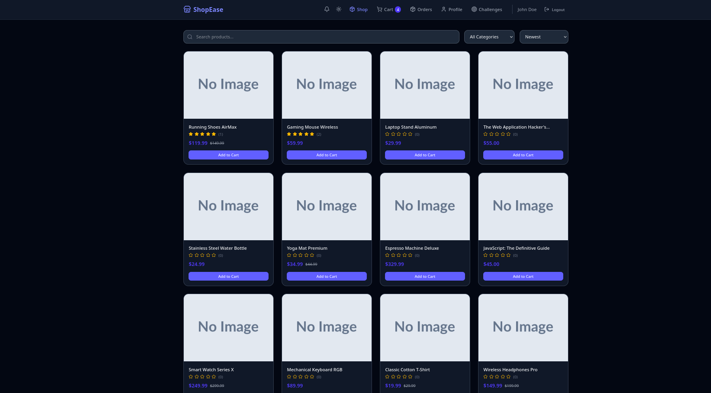
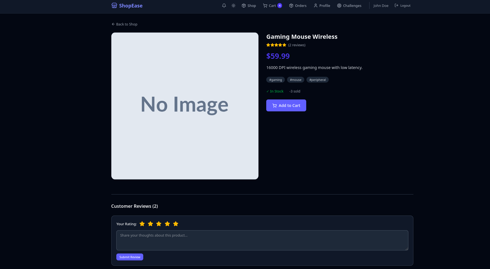
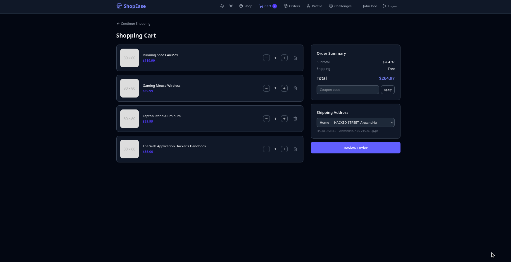
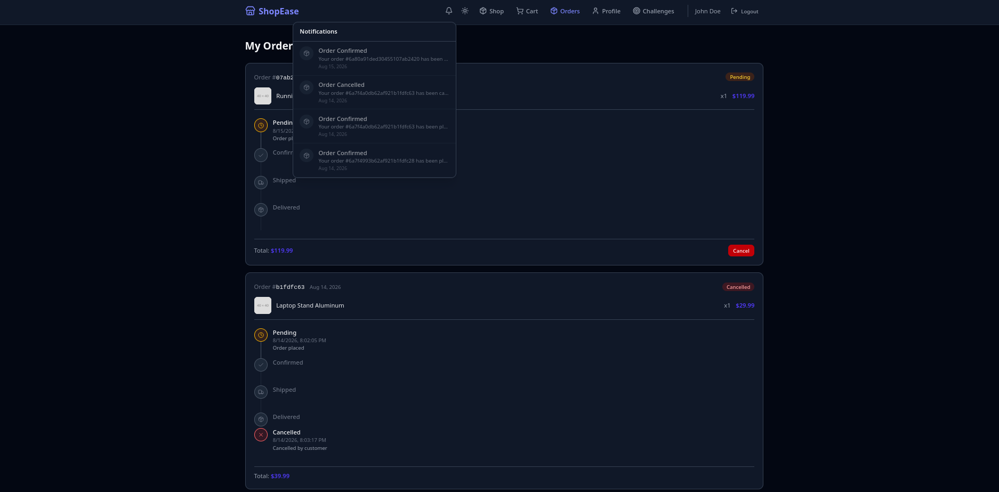
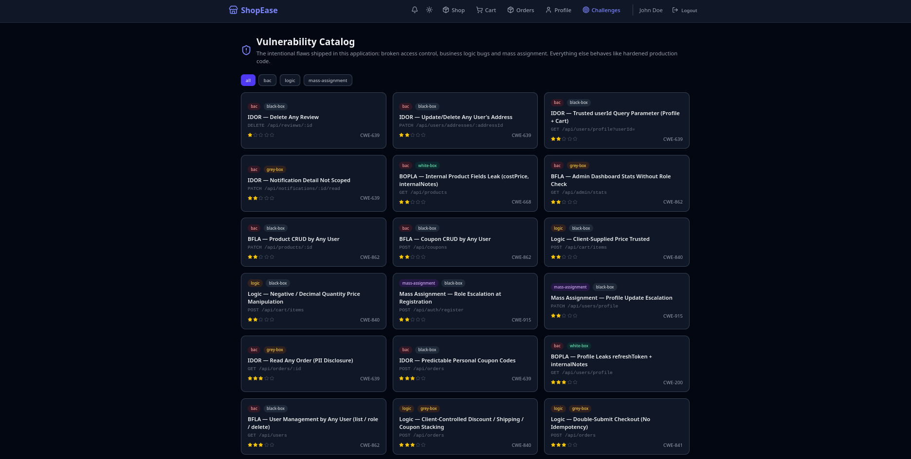

# ShopEase — E-Commerce Security Training

> ⚠️ **TRAINING ONLY — NOT FOR PRODUCTION**
> This app intentionally contains **24 exploitable security flaws** (broken access control, business logic bugs, mass assignment). Run it only on your local machine or an isolated environment. Never deploy it publicly or use real data.

ShopEase is a full-featured e-commerce app — shop, cart, orders, and admin dashboard — designed to practice web security testing. It behaves like a real production app, except that every major endpoint ships a deliberate vulnerability, documented in **[CHALLENGES.md](./CHALLENGES.md)** and browsable in-app at **/challenges**.

## Quick Start

**Requirements:** Node.js 22+. No Docker or MongoDB needed — the app starts its own embedded MongoDB.

```bash
git clone <repo-url>
cd <project-folder>

npm run setup      # install deps + create .env + seed database (first time only)
npm run dev:all    # start backend (:5000) + frontend (:5173)
```

Open **http://localhost:5173** and log in:

| Email           | Password  | Role     |
|-----------------|-----------|----------|
| admin@shop.com  | admin123  | Admin    |
| john@test.com   | user123   | Customer |

> First run downloads a MongoDB binary (~80 MB) once and caches it. Everything after that runs offline. Data is stored locally in `.mongodb-data/`.

## Screenshots











## Using Your Own MongoDB (optional)

Set `MONGODB_URI` in `.env` to use your own MongoDB instead of the embedded one:

```
MONGODB_URI=mongodb://localhost:27017/ecommerce
```

Or with Docker: `docker compose up -d`

## Tech Stack

| Layer     | Tech                                              |
|-----------|---------------------------------------------------|
| Backend   | Node.js, Express 5, TypeScript, MongoDB + Mongoose |
| Frontend  | React 19, Vite, Tailwind CSS v4                   |
| Auth      | JWT (access + refresh), bcryptjs                  |
| Other     | Cloudinary (uploads), helmet, express-rate-limit  |

## Project Structure

```
├── src/          # Backend
│   ├── modules/  # Feature modules (auth, users, products, cart, orders, coupons, ...)
│   ├── seed/     # Database seeding scripts
│   ├── shared/   # Middleware + utilities
│   └── config/   # Config + embedded MongoDB bootstrap
├── client/       # Frontend (React + Vite)
└── .env.example  # Template copied to .env by npm run setup
```

## Training

1. Open **http://localhost:5173/challenges** — each entry explains the bug, its impact, and the affected endpoint.
2. Every flaw is marked in the source with a `// VULNERABILITY (<key>)` comment for white-box practice.
3. The database is not wiped on restart. Re-seed anytime with `npm run seed:all` or `npm run seed:reset`.

## API Overview

All endpoints are prefixed with `/api`:

| Area          | Base                   | Highlights                          |
|---------------|------------------------|-------------------------------------|
| Auth          | `/api/auth`            | register, login, refresh, logout    |
| Users         | `/api/users`           | profile, addresses, wishlist        |
| Products      | `/api/products`        | CRUD + filters, featured, slug      |
| Categories    | `/api/categories`      | CRUD                                |
| Cart          | `/api/cart`            | items, quantities, clear            |
| Orders        | `/api/orders`          | create from cart, status, cancel    |
| Reviews       | `/api/reviews`         | per-product reviews                 |
| Coupons       | `/api/coupons`         | CRUD + validation                   |
| Notifications | `/api/notifications`   | list, mark read                     |
| Admin         | `/api/admin`           | stats, order export                 |

Full details are in the source under `src/modules/`. Health check: `GET /api/health`.

## Environment Variables

| Variable                 | Default               | Description                      |
|--------------------------|-----------------------|----------------------------------|
| `PORT`                   | `5000`                | Backend port                     |
| `MONGODB_URI`            | empty (embedded)      | MongoDB connection string        |
| `JWT_SECRET`             | fallback in code      | Access token secret              |
| `JWT_EXPIRE`             | `7d`                  | Access token expiry              |
| `JWT_REFRESH_SECRET`     | fallback in code      | Refresh token secret             |
| `JWT_REFRESH_EXPIRE`     | `7d`                  | Refresh token expiry             |
| `CLOUDINARY_*`           | —                     | Optional image upload settings   |

## Scripts

| Command               | Description                              |
|-----------------------|------------------------------------------|
| `npm run setup`       | Install all deps + create `.env` + seed  |
| `npm run dev:all`     | Run backend + frontend together          |
| `npm run dev`         | Backend only (hot reload, :5000)         |
| `npm run dev:frontend`| Frontend only (Vite, :5173)              |
| `npm run seed:all`    | Re-seed the database                     |
| `npm run seed:reset`  | Wipe and re-seed everything              |
| `npm run build`       | Compile TypeScript                       |
| `npm start`           | Production mode (serves API + built SPA) |